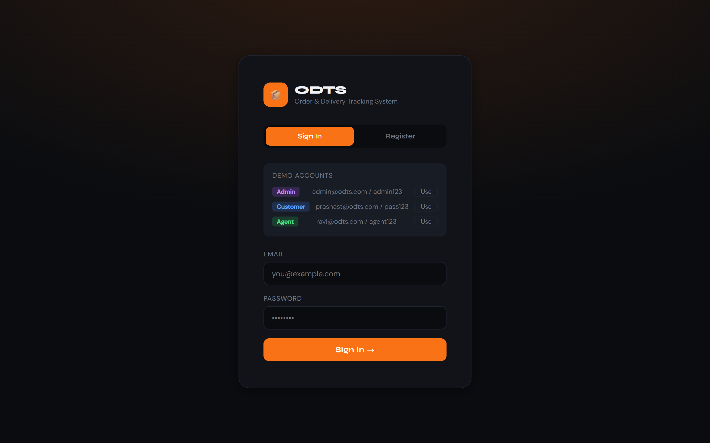
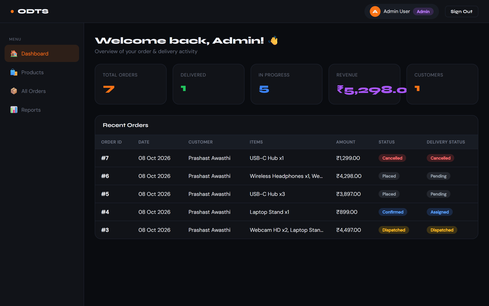
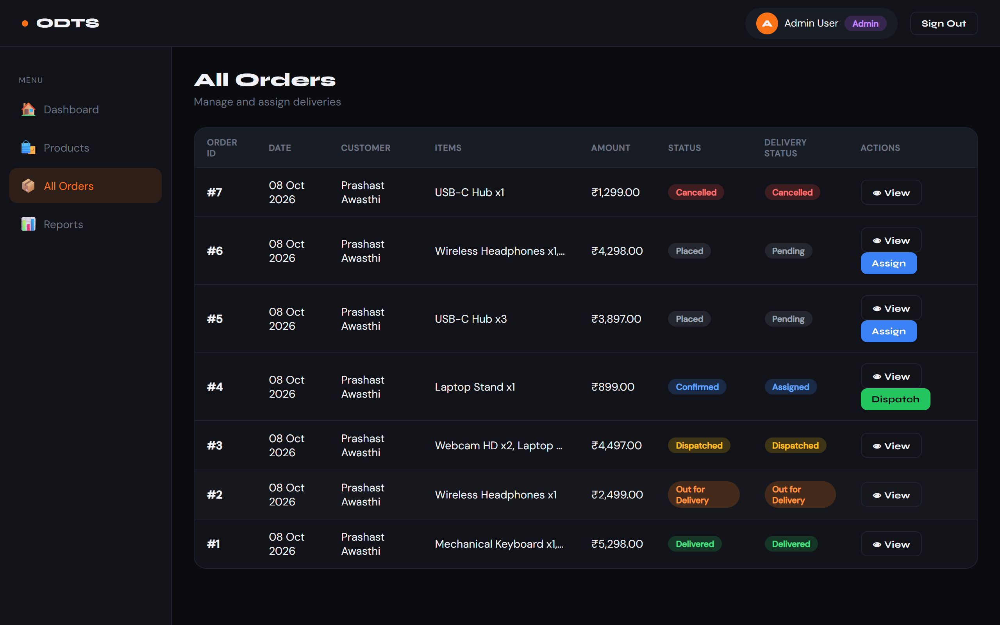
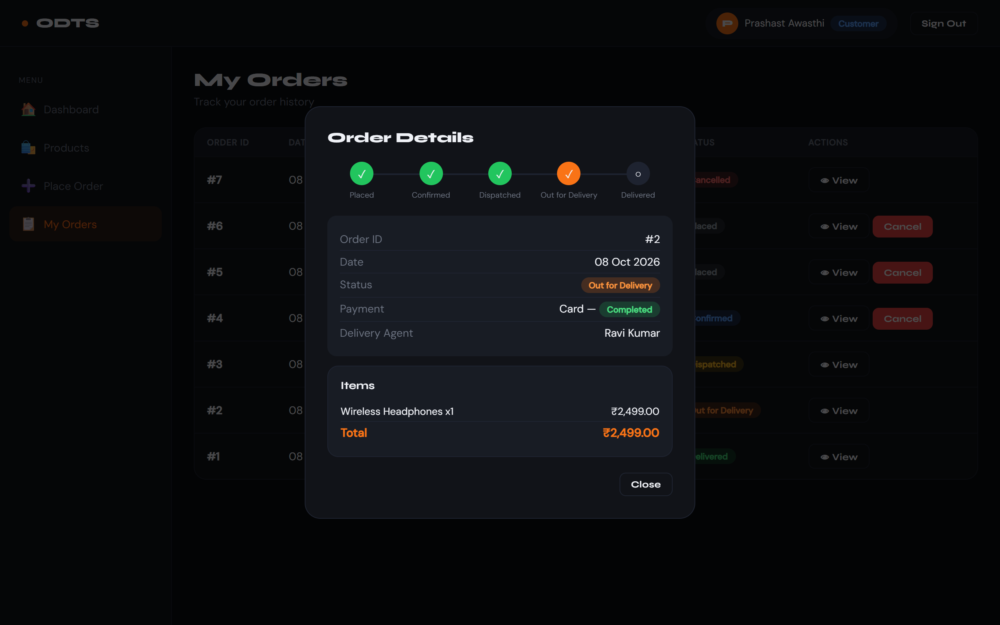
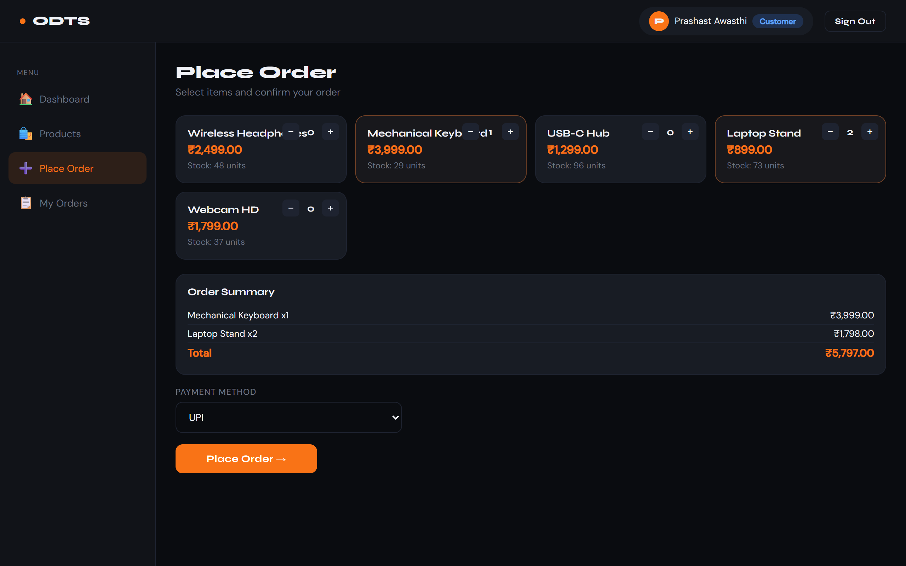
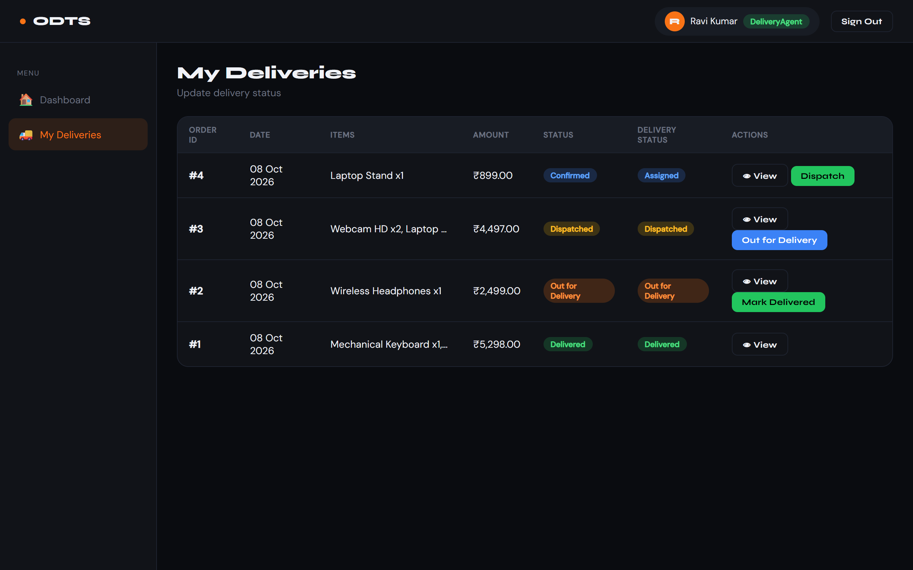
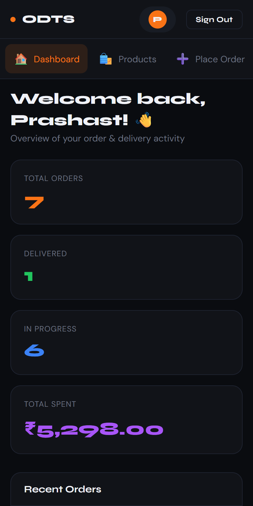

# ODTS: Order & Delivery Tracking System

[](https://github.com/awasthiprashast/Order-tracking-system/actions/workflows/ci.yml)

A full-stack order management app with three roles (customer, admin, delivery agent) covering the whole lifecycle: browse, order, assign, dispatch, deliver.

**Live demo:** https://odts-order-tracking.onrender.com (the free tier sleeps when idle, so the first load can take about 30 seconds).

Sign in with the one-click demo accounts on the login page:

| Role | Email | Password |
|---|---|---|
| Admin | admin@odts.com | admin123 |
| Customer | prashast@odts.com | pass123 |
| Delivery agent | ravi@odts.com | agent123 |

> Demo data is reset whenever the server restarts. Do not enter real personal data.

## Screenshots
| | |
|---|---|
|  |  |
| **Login with one-click demo accounts** | **Admin dashboard** |
|  |  |
| **Admin: assign agents and dispatch** | **Customer: order tracking timeline** |
|  |  |
| **Customer: place an order** | **Delivery agent: update deliveries** |



## Features
- **Customer:** register and sign in, browse products, build a multi-item cart, choose a payment method (UPI, Card, NetBanking, COD), track orders on a timeline, and cancel before dispatch.
- **Admin:** dashboard stats, view all orders, assign delivery agents, dispatch, and view revenue and order reports.
- **Delivery agent:** see assigned deliveries and move them through Dispatched, Out for Delivery and Delivered.

## Engineering notes
- Role-based access control is enforced on the server, including ownership checks. Admin accounts can't be self-registered.
- The order status workflow is a strict state machine (`Placed → Confirmed → Dispatched → Out for Delivery → Delivered`, with cancel allowed before dispatch).
- Orders are placed in one transaction with an atomic stock check, so concurrent orders can't oversell. Cancelling restocks and refunds.
- Passwords use salted PBKDF2-SHA256. Sessions expire after 12 hours, and login attempts are rate-limited.
- Input is validated with Pydantic, and the frontend escapes all rendered data.
- Covered by pytest tests that run in GitHub Actions.

## Tech stack
FastAPI, SQLite and Pydantic on the backend. The frontend is vanilla HTML, CSS and JS in a single file with no build step. FastAPI serves both the API (`/api/*`) and the UI (`/`).

```
frontend/index.html   single-page UI
backend/main.py       REST API + static file serving
backend/tests/        pytest suite
render.yaml           Render deployment blueprint
```

## Run locally
```bash
cd backend
pip install -r requirements.txt
uvicorn main:app --reload --port 8000
```
Open http://localhost:8000. Interactive API docs are at http://localhost:8000/docs.

Run the tests:
```bash
pip install -r requirements-dev.txt
pytest tests
```

## Deploy to Render
1. Push this repo to GitHub.
2. In Render, choose **New → Blueprint** and select the repo. It picks up `render.yaml`.
3. Deploy, then paste the resulting URL at the top of this README.

## API overview
| Method | Path | Access |
|---|---|---|
| POST | `/api/auth/register`, `/api/auth/login`, `/api/auth/logout` | public / authenticated |
| GET | `/api/products` | public |
| POST | `/api/orders` | customer |
| GET | `/api/orders` | role-scoped (own orders, assigned orders, or all) |
| PATCH | `/api/orders/{id}/status` | customer (cancel own), agent (assigned), admin |
| POST | `/api/orders/{id}/assign` | admin |
| GET | `/api/users/agents`, `/api/reports/summary` | admin |

## Data model
User, Product, Order, OrderItem, Payment and Delivery tables in SQLite (`ordertrack.db`, created and seeded on first run).

Built by [Prashast Awasthi](https://github.com/awasthiprashast) as an SE lab project (BCSE301P).
